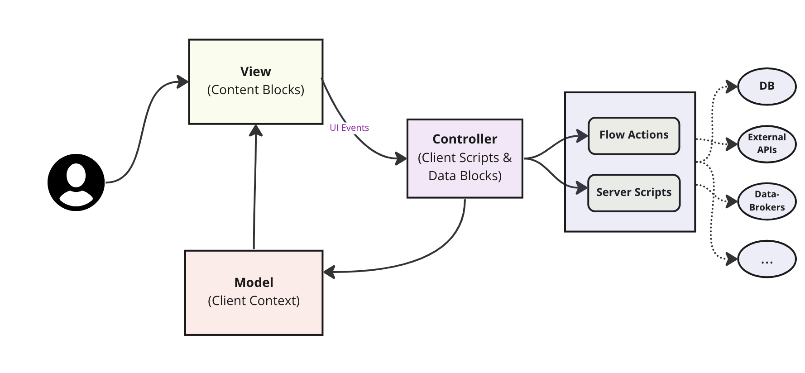

# Getting Started 
    Admin Experience Framework (a.k.a ACE) is a framework used to build quick and easy Admin experiences with lot of ready-to-use contents that can be added into the experiences using a point-and-click editor. 

    ACE Editor is an opinionated builder specifically designed to build experiences that suits Admin persona unlike **UI Builder** which is a general purpose builder.

# Installation instructions 

# Basic concepts and terminology 

-   **Content Block**
    -   A Content Block is a meta-data representation of an element inside a content tree. An ACE page is a composed of multiple content blocks arranged in a particular composition to create the desired content and layout.
    -   Example: Left Navigation Menu, Simple Card, List, Form, Accordion, etc., are all examples of ACE dontent Blocks
    Typically, a content block looks like below - 
    ```
        {
            block_id: "block1",
            type: {
                route: "simple_card_with_button"                
            },
            title: "Person Card",
            subtitle: "This is a sample person card",     
            props_details: {
                footer: "Please contact the above number if found"
            },
            visibility: true,
            active: true            
        }
    ```
-   **Content Type**
    -   Any Content Block must have a content type. Content Type defines the type of the content block which is required to render the meta-data in UI accordingly. 
    There are different types of Content Types available - 
        1. Out-of-the-box Content Types
        4. Generic Content Types
        2. Reusable Content Types
        3. Custom Content Types

-   **ACE Experience**
	-   ACE Experience is a wrapper on a UXF Experience that maintains experience level mappings like Modules, reference to it's ACE Pages etc.
    Just to get a quick understanding of UXF Experience, below are the important tables to remember - 
        1. Experience (Page Registry) - SYS_UX_PAGE_REGISTRY 
        2. Admin Panel (App Config) - SYS_UX_APP_CONFIG
        3. App Shell - SYS_UX_MACROPONENT with category=App Shell
        4. Page (Route) - SYS_UX_APP_ROUTE
        5. Variant (Screen) - SYS_UX_SCREEN
        6. Screen Collection (m2m) - SYS_UX_SCREEN_TYPE
        7. Macroponent (Content Fragment) - SYS_UX_MACROPONENT 

    ACE Experience (SN_ACE_APP_CONFIG) has the mapping to the Admin Panel of the UX Experience along with the mapping to the ACE Pages and ACE Modules. 

    -   Below are the important tables specific to ACE - 
        1. SN_ACE_APP_CONFIG - ACE Application Configuration which has the mapping to the UX App Config
        2. SN_ACE_PAGE - ACE Page which has the reference to the route of the UX Page 
        3. SN_ACE_CONTENT_BLOCK - Contents of an ACE Page are composed using content block records in this table. This is a self-referencing table that helps create hierarical structure of the contents of the page. 
        4. SN_ACE_CONTENT_BLOCK_TYPE - Each Content Block of a page is made up of a specific content type that is defined in this table.
        5. SN_ACE_VARIABLE - Mapping table between a content type and the respective property type (Glide Variable). 

-   **ACE Page**
    -   **ACE Page** is basically a UXF page that is rendered entirely by configuring the metadata in ACE.
    -   This page will typically consist of just a single ACE Content Manager in its definition, and the rest of the contents will be handled internally based on the ACE content configuration. 
    
    -   Why do we need a UXF Page if ACE Content Manager renders all the contents? 
        Reason why we need UXF Page is to render within an experience under the same App Shell to switch between pages using the UXF routing capability as well as to take the advantage of client scripting environment that is required to provide an advanced capability to the developers to handle the events emitting from the ACE Content Manager and change the content tree or the client context as per the demands of the business requirements. 

    -   **Hybrid ACE Page**: A UIB page that is partially driven by ACE by adding the ACE Content Block somewhere in its composition.
    This mode of development is strongly discouraged as the handling of the contents and the context of the Content Manager requires to be taken care by the developer who owns these Hybrid pages and the contract of the content tree and client context is subject to change based on future use-cases that will lead to maintainability issues for the Hybrid ACE pages. 

-   **ACE Variable**
    -   Each Content Type requires certain properties that needs to be passed to the repective Content Block. These dynamic properties are captured using ACE Variables, which are different for different Content Types.
    -   For example, an Analytics Card will require a Table Name, Field Name, Chart Type, Group by Field, Label, etc. Similarly, a Plugin Installation Content Type requires a list of plugins, a Plugin Home URL, etc. These dynamic requirements are served using the Glide-Vars feature, which allows for the configuration of different property values (variables) based on the selected Content Type.

# Content Manager

ACE Content Manager (sn-ace-content-manager) is the builder component that is responsible for registering the required components and macroponents used by the content tree (view meta-data) that is passed as a property to the component. 
It also accepts another property called "blockcontext" which is the client context that the content blocks inside the above content tree are mapped to for dynamic data binding.

And the internal components inside the Content Manager help read the content tree passed to the component as a property and recursively traverse the tree to build the respective VDOM that in-turn renders the contents via DOM.


## Design pages using Model View Controller pattern 
When designing your pages, always try to follow MVC pattern for clear separation of concern between the view layer and the data control layer. 
Client Context acts as a Model and the View layer (i.e., Content blocks) should be configured to map to the model (client context) using property mapper capability in the ACE Editor. 
And on an event trigger, the event handler should update the Model (client context) which in-turn will trigger the respective Content Blocks to re-render to reflect the change. 

One such event handling mechanism is to write a Client Script that conditionally listens to the white-listed events and based on the payload of the event the scripting logic can be written to directly update the client context or invoke a Data block that can invoke an external API to fetch the required data and update the same in the client context. Once the client context is updated, view layer will be refreshed by re-rendering the respective content blocks whose properties are mapped to the client context earlier. 

